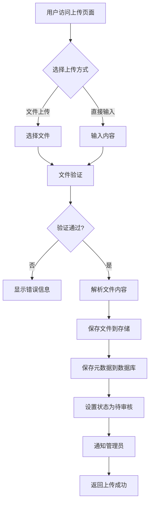
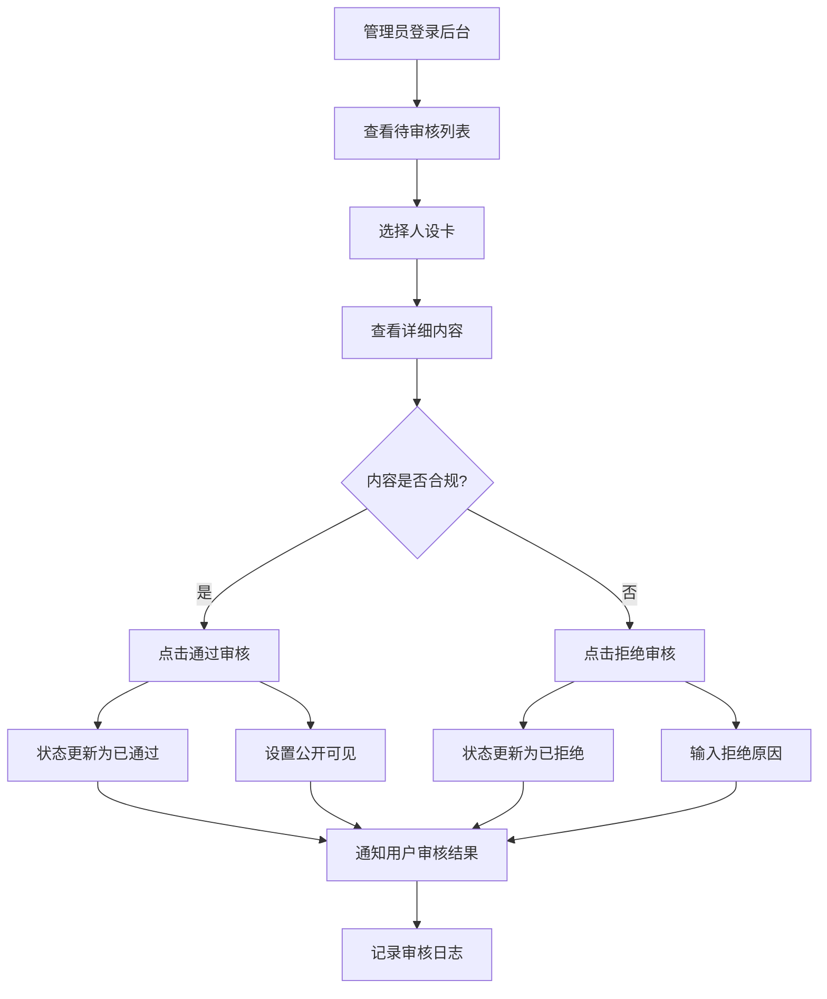
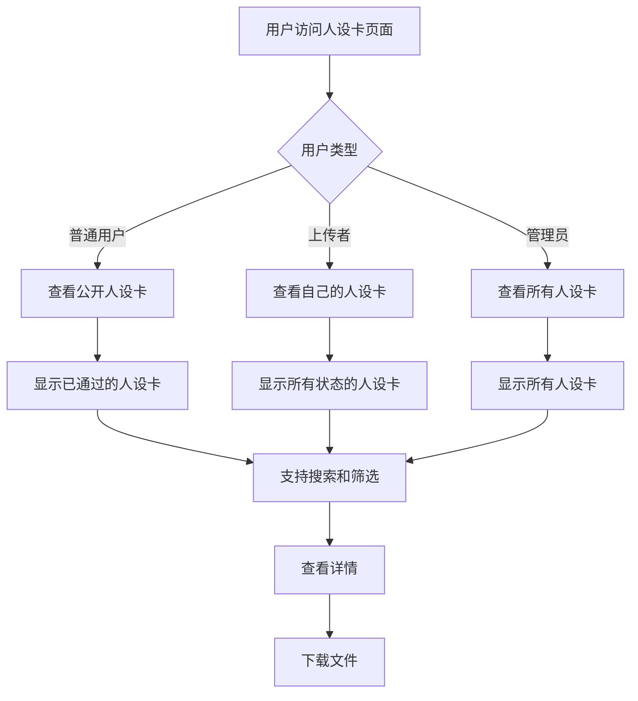

# 人设卡系统工作流程

## 概述

人设卡系统是MaiMai NotePad平台的核心功能之一，允许用户上传、分享和管理AI角色设定卡。系统支持多种文件格式，提供完整的审核流程，确保内容质量和平台安全。

## 核心功能

### 1. 文件格式支持
- **JSON格式**: 结构化角色数据，便于程序解析
- **Markdown格式**: 富文本格式，支持格式化显示
- **TOML格式**: 配置文件格式，易于阅读和编辑
- **纯文本格式**: 简单文本，兼容性强

### 2. 审核机制
- **待审核状态**: 新上传的人设卡默认状态
- **审核通过**: 管理员审核通过后设为公开
- **审核拒绝**: 不合规内容将被拒绝并通知用户
- **自动通知**: 审核结果通过邮件通知用户

### 3. 内容管理
- **文件内容优先**: 支持文件上传和直接内容输入
- **版本控制**: 记录人设卡的修改历史
- **分类标签**: 支持分类和标签管理
- **搜索筛选**: 提供多维度搜索功能

## 工作流程图

### 用户上传流程



### 管理员审核流程



### 用户查看流程



## API接口详解

### 上传接口

**POST /api/character/upload**

支持两种上传方式：

1. **文件上传**（multipart/form-data）
```javascript
const formData = new FormData();
formData.append('file', fileInput.files[0]);
formData.append('title', '角色名称');
formData.append('description', '角色描述');
formData.append('category', '分类');
formData.append('tags', '标签1,标签2');
```

2. **直接内容**（application/json）
```json
{
  "title": "角色名称",
  "description": "角色描述",
  "content": "角色设定内容",
  "category": "分类",
  "tags": ["标签1", "标签2"]
}
```

### 审核接口

**PUT /api/admin/characters/:id/review**

```json
{
  "action": "approve",  // 或 "reject"
  "comments": "审核意见",
  "reason": "拒绝原因"   // 拒绝时必填
}
```

### 查询接口

**GET /api/character/list**

查询参数：
- `page`: 页码（默认1）
- `limit`: 每页数量（默认10）
- `category`: 分类筛选
- `tags`: 标签筛选
- `search`: 关键词搜索
- `sort`: 排序方式（newest, oldest, popular）

返回格式：
```json
{
  "success": true,
  "data": {
    "characters": [...],
    "pagination": {
      "page": 1,
      "limit": 10,
      "total": 100,
      "pages": 10
    }
  }
}
```

## 数据结构

### 人设卡对象

```json
{
  "_id": "507f1f77bcf86cd799439011",
  "title": "智能助手小艾",
  "description": "一个友好的AI助手角色",
  "content": "详细的人设内容...",
  "fileUrl": "https://r2.example.com/characters/123.json",
  "fileType": "application/json",
  "format": "json",
  "category": "AI助手",
  "tags": ["AI", "助手", "友好"],
  "author": {
    "id": "user123",
    "username": "creator_user",
    "email": "user@example.com"
  },
  "status": "approved",
  "isPublic": true,
  "downloadCount": 42,
  "rating": {
    "average": 4.5,
    "count": 8
  },
  "review": {
    "reviewedBy": "admin456",
    "reviewedAt": "2024-01-15T10:30:00Z",
    "comments": "内容完整，符合平台规范",
    "reason": null
  },
  "createdAt": "2024-01-10T08:00:00Z",
  "updatedAt": "2024-01-15T10:30:00Z"
}
```

### 状态说明

- **pending**: 待审核状态，只有上传者和管理员可见
- **approved**: 审核通过，所有用户可见
- **rejected**: 审核拒绝，只有上传者和管理员可见

## 安全机制

### 文件上传安全
1. **文件类型检查**: 严格限制允许的文件格式
2. **文件大小限制**: 最大10MB
3. **内容扫描**: 检查恶意代码和不当内容
4. **病毒扫描**: 集成杀毒引擎（可选）

### 内容审核
1. **关键词过滤**: 自动检测敏感词汇
2. **图片内容识别**: 检测不当图片（如有图片）
3. **人工审核**: 管理员人工检查内容质量
4. **用户举报**: 支持用户举报不当内容

### 权限控制
1. **用户认证**: JWT令牌验证
2. **角色权限**: 区分普通用户、上传者、管理员
3. **资源访问**: 基于状态和用户身份的访问控制
4. **操作日志**: 记录所有重要操作

## 性能优化

### 文件处理优化
1. **异步处理**: 文件上传和解析异步进行
2. **分片上传**: 大文件支持分片上传
3. **压缩存储**: 文件压缩后存储
4. **CDN加速**: 静态文件使用CDN分发

### 数据库优化
1. **索引优化**: 关键字段建立索引
2. **分页查询**: 大数据集分页显示
3. **缓存机制**: 热门数据缓存处理
4. **读写分离**: 读写操作分离（高并发场景）

## 错误处理

### 上传错误
```javascript
{
  "success": false,
  "error": {
    "code": "FILE_TOO_LARGE",
    "message": "文件大小超过限制（最大10MB）",
    "details": {
      "maxSize": 10485760,
      "actualSize": 15728640
    }
  }
}
```

### 审核错误
```javascript
{
  "success": false,
  "error": {
    "code": "INVALID_STATUS_TRANSITION",
    "message": "状态转换无效",
    "details": {
      "currentStatus": "approved",
      "requestedAction": "approve"
    }
  }
}
```

## 监控与统计

### 业务指标
- 上传成功率
- 审核通过率
- 平均审核时间
- 用户活跃度
- 热门分类统计

### 系统指标
- 文件处理速度
- 数据库存储使用
- 文件存储使用
- 系统响应时间
- 错误率统计

## 扩展功能

### 计划中的功能
1. **版本管理**: 支持人设卡版本更新
2. **协作编辑**: 多用户协作编辑
3. **模板系统**: 提供人设卡模板
4. **AI辅助**: AI辅助生成人设卡
5. **社区功能**: 评论、点赞、收藏
6. **批量操作**: 批量上传和审核

### 技术改进
1. **分布式存储**: 支持多地域存储
2. **实时通知**: WebSocket实时通知
3. **智能审核**: AI辅助内容审核
4. **性能监控**: 更详细的性能监控
5. **自动化测试**: 完整的自动化测试覆盖