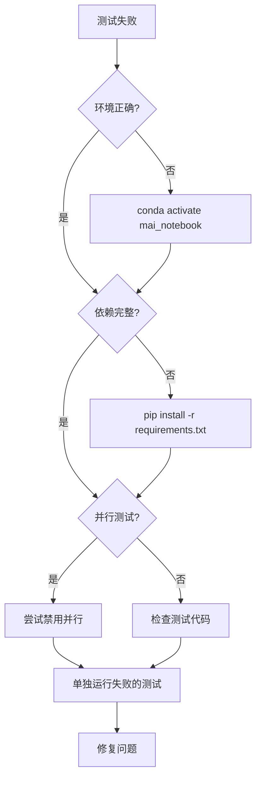

# 测试环境设置指南

## 快速开始

### 1. 激活 Conda 环境

```bash
conda activate mai_notebook
```

### 2. 检查环境

```bash
./manage.sh test-env
```

预期输出：
```
✓ Conda 环境: mai_notebook
ℹ  Python 版本: 3.13.x
ℹ  检查关键依赖...
✓ 所有关键依赖已安装

ℹ  测试配置:
ℹ    并行测试: true
ℹ    工作进程: auto
ℹ    推荐环境: mai_notebook
```

### 3. 运行测试

```bash
./manage.sh test
```

## 环境要求

### Python 版本
- Python 3.11+ (推荐 3.13)

### 关键依赖
- pytest >= 7.4.3
- pytest-xdist >= 3.6.1
- pytest-cov >= 6.0.0
- pytest-asyncio >= 1.3.0
- hypothesis >= 6.151.9
- fastapi
- sqlalchemy

### 安装依赖

```bash
# 确保在正确的环境中
conda activate mai_notebook

# 安装所有依赖
pip install -r requirements.txt

# 验证安装
./manage.sh test-env
```

## 常见问题

### Q1: 测试卡住不动

**症状**：运行 `pytest` 后没有任何输出，进程卡住

**原因**：pytest-xdist 未正确安装在当前 Python 环境中

**解决方案**：
```bash
# 1. 确认当前环境
conda activate mai_notebook

# 2. 检查 xdist 是否安装
python -c "import xdist; print(xdist.__version__)"

# 3. 如果报错，重新安装
pip install --force-reinstall pytest-xdist

# 4. 验证
./manage.sh test-env
```

### Q2: 环境检查失败

**症状**：运行 `./manage.sh test-env` 显示依赖缺失

**解决方案**：
```bash
# 1. 确认环境
conda activate mai_notebook

# 2. 重新安装依赖
pip install -r requirements.txt

# 3. 如果还有问题，清理并重装
pip cache purge
pip install --no-cache-dir -r requirements.txt
```

### Q3: 并行测试出现随机失败

**症状**：某些测试在并行运行时失败，单独运行时通过

**临时解决方案**：
```bash
# 编辑 tests/.test_env
# 将 TEST_PARALLEL=true 改为 TEST_PARALLEL=false
```

**永久解决方案**：
- 检查测试是否正确使用 fixtures
- 确保测试之间没有状态共享
- 使用 `@pytest.mark.serial` 标记需要串行运行的测试

### Q4: 切换环境后测试失败

**症状**：从 base 环境切换到 mai_notebook 后测试失败

**原因**：不同环境的依赖版本不一致

**解决方案**：
```bash
# 1. 清理旧的测试数据
./manage.sh cleanup

# 2. 删除测试数据库
rm -f tests/test_*.db*

# 3. 重新运行测试
./manage.sh test
```

## 环境隔离

### 为什么需要独立的 Conda 环境？

1. **依赖隔离**：避免不同项目的依赖冲突
2. **版本控制**：确保所有开发者使用相同的依赖版本
3. **测试稳定性**：避免全局包影响测试结果

### 创建新的 Conda 环境

```bash
# 创建环境
conda create -n mai_notebook python=3.13

# 激活环境
conda activate mai_notebook

# 安装依赖
pip install -r requirements.txt

# 验证
./manage.sh test-env
```

## 性能优化

### 并行测试配置

编辑 `tests/.test_env`：

```bash
# 自动检测 CPU 核心数（推荐）
TEST_WORKERS=auto

# 或指定固定数量
TEST_WORKERS=4

# 禁用并行（调试时使用）
TEST_PARALLEL=false
```

### 性能对比

| 配置 | 执行时间 | CPU 使用率 | 适用场景 |
|------|---------|-----------|---------|
| TEST_WORKERS=auto | ~40秒 | 600%+ | 日常开发 |
| TEST_WORKERS=4 | ~45秒 | 400% | 固定配置 |
| TEST_PARALLEL=false | ~180秒 | 100% | 调试问题 |

## 最佳实践

### 1. 始终使用推荐环境

```bash
# 在 ~/.bashrc 或 ~/.zshrc 中添加别名
alias mai='conda activate mai_notebook'
```

### 2. 运行测试前检查环境

```bash
# 养成习惯
./manage.sh test-env && ./manage.sh test
```

### 3. 定期更新依赖

```bash
# 每周或每月更新一次
conda activate mai_notebook
pip install --upgrade -r requirements.txt
```

### 4. 保持配置文件同步

```bash
# 如果修改了 tests/.test_env，提交到版本控制
git add tests/.test_env
git commit -m "Update test configuration"
```

## 故障排查流程



## 相关命令速查

```bash
# 环境管理
conda activate mai_notebook          # 激活环境
conda deactivate                     # 退出环境
conda env list                       # 列出所有环境

# 测试命令
./manage.sh test-env                 # 检查环境
./manage.sh test                     # 运行所有测试
./manage.sh test-unit                # 运行单元测试
./manage.sh test-int                 # 运行集成测试
./manage.sh test-cov                 # 生成覆盖率报告

# 清理命令
./manage.sh cleanup                  # 清理缓存
rm -f tests/test_*.db*               # 清理测试数据库

# 依赖管理
pip list | grep pytest               # 查看 pytest 相关包
pip install --upgrade pytest-xdist   # 更新 xdist
pip freeze > requirements.txt        # 导出依赖
```

## 获取帮助

```bash
# 查看 manage.sh 帮助
./manage.sh help

# 查看 pytest 帮助
pytest --help

# 查看测试配置文档
cat docs/development/test_configuration.md
```


---

**文档信息**

| 项目 | 内容 |
|------|------|
| 创建日期 | 2026-02-22 |
| 最后更新 | 2026-02-22 |
| 维护者 | CorrectPath, A-Dawn, cuckoo711 |
| 状态 | 📝 参考文档 |
